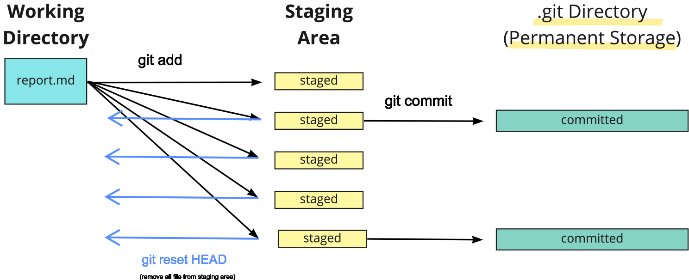

# **Outline**

- [**Shell Commands**](#shell-commands)
    - [**Bash**](#bash)
        - [**Simple commands**](#simple-commands)
        - [**Special operators**](#special-operators)
        - [**Advanced commands**](#advanced-commands)
        - [**Data manipulation bash commands for CSV files**](#data-manipulation-bash-commands-for-csv-files)
        - [**PATH**](#path)
    - [**SSH**](#ssh)
- [**Line-Commands Tools**](#line-commands-tools)
    - [**Git/GitHub**](#gitgithub)
        - [**Config and Init**](#config-and-init)
        - [**Branch and Checkout**](#branch-and-checkout)
        - [**Stage area and commit**](#stage-area-and-commit)
        - [**Remote**](#remote)
        - [**Push and Pull**](#push-and-pull)
        - [**Merge and Rebase**](#merge-and-rebase)
        - [**Large Files**](#large-files)
    - [**Pipenv and Pyenv**](#pipenv-and-pyenv)
    - [**Docker**](#docker)
    - [**Kubernetes and Kind**](#kubernetes-and-kind)
    - [**Others**](#others)
        - [**Repository structure**](#repository-structure)
        - [**jupyter**](#jupyter)
        - [**Jekyll**](#jekyll)
        - [**Xelatex**](#xelatex)

# Shell commands


# **Bash**

## **Simple commands**

`pwd` stands for "print working directory". 

```bash
pwd
```

Change the current working directory:

```bash
cd <directory-name>
```

Create a new directory:

```bash
mkdir <directory-name>
```

Create the <file-name> file:

```bash
touch <file-name>
```

List the files and directories in the current directory. The `-l` flag is used to display the long format, and the `-h` flag is used to display the file size in human-readable format.

```bash
ls -lh
```

Copy the file to the destination repository:

```bash
cp /path/to/source/repo/file /path/to/destination/repo/
```

Rename a file in a repository:

```bash
mv old-file-name <new-file-name>
```

Remove all files and subdirectories in the current directory:

```bash
rm -rf *
```

`cat` stands for "concatenate". Display the contents of a file.

```bash
cat <file-name>
```


Find the location of a program:

```bash
which <program-name>
```
Return the type of a program:

```bash
type <program-name>
```

Display a line of text/string that is passed as an argument. 

```bash
echo <text>
```

It searches the given file for lines containing a match to the given strings or words.

```bash
grep "word-to-search" file.txt  
```

## **Special operators**

The `>` operator is used to redirect the output of a command to a file. If the file already exists, it will be overwritten. If the file does not exist, it will be created.

```bash
echo "Hello, World!"> myfile.txt
```

The `>>` operator is used to redirect the output of a command to a file. If the file already exists, the output will be appended to the end of the file. If the file does not exist, it will be created.

```bash
echo "Hello, World!">> myfile.txt
```

The `|` operator is used to redirect the output of a command to another command. It is called a pipe. The output of the first command is used as the input of the second command.

```bash
echo "Hello, World!" | wc
```

Another way to search text is using the pipe operator with cat. The pipe operator is used to redirect the output of a command to another command.

```bash
cat file.txt | grep "word-to-search"
```

The `&&` operator is used to execute a second command after the first command has finished executing. The second command will only be executed if the first command was successful.

```bash
echo "Hello, World!" && echo "Hello, World!"
```

The `;` operator is used to execute a second command after the first command has finished executing. The second command will be executed regardless of whether the first command was successful.

```bash
echo "Hello, World!"; echo "Hello, World!"
```

The `&` operator is used to run a command in the background. The command will be executed in the background, and the shell prompt will return immediately.

```bash
sleep 10 &
```

The `*` operator is used to match zero or more characters. It is called a wildcard. It can be used to match any file or directory name.

```bash
ls *.txt
```

## **Advanced commands**


List all the files installed by a program. The `dpkg` is the package management program that installs, removes, and provides information about `.deb` packages. The `grep` command-line searches through text and prints lines that match a pattern.

```bash
dpkg -L <program-name> | grep bin/
```


netstat is a command-line utility that displays network connections for the Transmission Control Protocol (both incoming and outgoing), routing tables, and a number of network interface (network interface controller or software-defined network interface) and network protocol statistics. The `t` flag is used to display TCP connections, the `u` flag is used to display UDP connections, the `l` flag is used to display only listening sockets, and the `n` flag is used to display numerical addresses instead of trying to determine symbolic host, port or user names. `grep <port-number>` is used to filter the displayed connections by a specific port number.

```bash
netstat -tuln | grep <port-number>
```

`lsof` stands for "list open files". Display information about files opened by processes. The `i` flag is used to display only internet connections, the `p` flag is used to display the PID and name of the program to which each socket belongs, and the `n` flag is used to display numerical addresses instead of trying to determine symbolic host, port or user names.

```bash
lsof -i -P -n | grep <port-number>
```
or 

```bash
sudo lsof -i :9696
```

chmod is a command This is the command used to change the file mode bits, which define the permissions of a file or directory. The `+x` flag is used to add executable permissions to a file.

```bash
chmod +x <file-name>
```
After this command is executed, we can run the script <file-name> directly from the command line like this: `./<file-name>.sh` .


Output of `<command>` into `awk`, which then prints the first field of each line. This is useful for extracting specific columns from a command's output, such as the process ID of a running program. The `NR` is a built-in variable in awk that contains the current line number. The `>1` is used to skip the first line of the output. We could change 1 to any number to skip the first n lines or print the n column.

```bash
<command> | awk 'NR>1{print $1}'
```

Converts input from standard input into arguments to a command. If we have a column from awk, then this would be transformed into a list of arguments that would be passed to the command.

```bash
<command> | xargs <command>
```

Used to find and display information about processes related to program. `ps` is used to display information about active processes, `a` Show processes for all users, `u` display the process's user/owner and `x` Also show processes not attached to a terminal.

```bash
ps aux | grep <program-name>
```

## Data manipulation bash commands for CSV files

count the number of lines in the file.
    
```bash
wc -l <file-name>
```

Display the first 10 lines of a file:

```bash
head -n 10 <file-name>
```

## **PATH**

The `PATH` environment variable contains multiple paths, each separated by a colon (:). The order of the paths matters. When type a command, the shell looks through these paths in the order they're listed. Once it finds a matching executable, it stops searching. If a program isn't running as expected, it might be because a different version earlier in your `PATH` is being executed instead.


Display the current value of the `PATH` environment variable:

```bash
echo $PATH
```

Add a new directory to the existing PATH environment variable:

```bash 
export PATH=$PATH:/path/to/directory
```


------

# **SSH**

Files in `~/.ssh` directory:

- config : The SSH client configuration file. It contains settings for SSH, such as hostname aliases, specific identity files (private keys) to use for different hosts, user names, port numbers, and other preferences for SSH connections. This file is read by the SSH client to determine how to connect to a particular server and with what credentials.

- .pub files: pThese are public SSH keys corresponding to their private counterparts (without the .pub extension). They are used in public-key cryptography to securely verify our identity. 


Creates a new ssh key, using the provided email as a label with ed25519 algorithm. The `-t` flag specifies the type of key to create. 

```bash
ssh-keygen -t ed25519 -C "your_email@example.com"
```

Start the SSH agent using `eval`:

```bash
eval $(ssh-agent -s)
```

or using the following command to get the output and then export it:

```bash
ssh-agent
    
    OUTPUT


export OUTPUT
```


Add the SSH private key to the SSH agent. This ensures the SSH agent is aware of the private key and will manage it, making it easier to establish connections without entering a passphrase every time.

```bash
ssh-add ~/.ssh/id_ed25519
```

Remove the SSH private key from the SSH agent:

```bash
ssh-add -d key_name
```


keys the SSH agent is currently holding 

```bash
ssh-add -l
```

cluster access
   
```bash
ssh -Y name@146.164.45.180 -p port
```
Change password:

```bash
passwd 
```

A "node" refers to a single computer or machine within the cluster. Each node can be a separate physical server, or it can be a virtual machine. To change of node in a cluster use:

```bash
ssh cn025
```

List all the nodes in the cluster:

```bash
sinfo -l
```

Displays information about the CPU architecture:

```bash
lscpu
```

Shows the amount of free and used memory in the system .
```bash
free -h
```

Information about the disk space usage on the cluster:
```bash
df -h
```

Gives detailed information about the GPU NVIDIA models, usage, memory:

```bash
nvidia-smi
```

Displays basic information about the system's kernel, operating system, and hardware platform:

```bash
uname -a
```

Commands show the current usage of CPU, memory, and other resources in real-time

```bash
top
```
or  more user-friendly interface:

```bash
htop
```

# **Line-Commands Tools**

------

# **Git/GitHub**

## **config and init**

List all the git configurations:

```bash
git config --list

git config --global --list

git config --local --list

```

Set the default branch name to main as in GitHub:

```bash
git config --global init.defaultBranch main
```

Initialize a git repository:

```bash
git init
```

Establish a new remote repository that our local repository can interact with:

```bash
git remote add origin <SSH_URL or HTTPS>
```

Difference between the working directory and the staging area:

```bash
git diff
```

List of news files and modified files:

```bash
git status
```

## **branch and checkout**

**git branch** is used for creating, listing, and deleting branches, while **git checkout** is used for switching between branches and also for creating a new branch if used with the -b flag.


List all the branches in the repository with -a flag:

```bash
git branch -a
```
or delete a branch with -d (-D to force deletion) flag:

```bash
git branch -d <branch-name>
```

Create and immediately switch to a new branch:

```bash
git branch -b <new-branch-name>
```
or

```bash
git checkout <new-branch-name>
```

Switch to an existing branch:

```bash
git checkout <branch-name>
```

Rename a branch:

```bash
git branch -m <old-branch-name> <new-branch-name>
```

## **Stage area and commit**

</center>  </center>


Add a file to the staging area:

```bash
git add <file-name>
```

Remove a file from the staging area before commit:

```bash
git reset <file-name>
```

Commit changes to head:

```bash
git commit -m "Commit message"
```

Stop tracking a file that was previously committed to the repository.  It's often used for files that should no longer be part of the repository (e.g., accidentally committed files, files that should be ignored).

```bash
git rm --cached <file-name>
```

Or remove all files from the staging area.The -r flag is for recursive removal, and . indicates the current directory.

```bash
git rm --cached -r .
```


Change the commit message or add/untrack  files to last commit (only if not pushed and after staging/unstaging the files with `git add` / `git rm`):

```bash
git commit --amend -m "New commit message"
```

Resets the current branch to a specific commit (or to the latest commit of a remote branch like origin/main), discarding all subsequent commits and local changes. This is commonly used to align the branch precisely with a remote branch, erasing any local divergences.

```bash
git reset --hard <commit-hash>
```


Create a new commit that undoes the changes by the specified commit <commit-hash>. This effectively exclude the commit from the branch without affecting the subsequent commits:

```bash
git revert <commit-hash>
```

Show the commit history for the currently active branch:

```bash
git log
```

## **Push and Pull**

Push the branch to remote repository:

```bash
git push origin <branch-name>
```

Pull changes from the remote repository to the local repository:

```bash
git pull origin <branch-name>
```

Apply local commits on top of the remote branch's commits:

```bash
git pull --rebase origin main
```

Fetch the changes from the remote repository to the local repository:

```bash
git fetch origin <branch-name>
```

## **Merge and Rebase**

Merge the specified branch into the current branch:

```bash
git merge <branch-name>
```

Rebase the current HEAD onto the specified branch:

```bash
git rebase <branch-name>
```

Create a new commit that undoes all of the changes made in <commit-hash>, then apply it to the current branch:

```bash
git revert <commit-hash>
```

## **Remote**

Replace the current working directory and staging area with the state of the tree at the given commit:

```bash
git reset --hard [commit-hash]

```

If we only want to reset the staging area and not affect the working directory. This will unstage any changes since the specified commit, but leave the files in the working directory unchanged. 

```bash
git reset [commit-hash]
```

Switch a repository's remote URL to use SSH in GitHub:

```bash
git remote set-url origin <SSH_URL>
```

List all the remote repositories:

```bash
git remote -v
```

## Large Files

initializes Git LFS in repository:

```bash
git lfs install
```

Track a file with Git LFS. It adds entries to the `.gitattributes`.

```bash
git lfs track <file-name>
```

Untrack a file with Git LFS:

```bash
git lfs untrack <file-name>
```

List all the files tracked by Git LFS:

```bash
git lfs ls-files
```

------
# **Pipenv and Pyenv**


Install Pipenv to manage project dependencies.

```bash
pip install pipenv
```
Install a specific package and add it to Pipfile. To install the packages from Pipfile, use only `pipenv install`.

```bash
pipenv install <package-name>
```

Uninstall a specific package and remove it from Pipfile.

```bash
pipenv uninstall <package-name>
```

Activate the virtual environment associated with your project.

```bash
pipenv bash
```

Show the location of the virtual environment for the project:

```bash
pipenv --venv
```

Remove the virtual environment for the project.

```bash
pipenv --rm
```

Update all packages to their latest versions as specified in Pipfile.

```bash
pipenv update
```

Update a specific package to its latest version as specified in Pipfile.

```bash
pipenv lock
```

Clearing the cache is useful to free up space or ensure that pipenv is using the most recent versions of packages without being influenced by cached data.

```bash
pipenv --clear
```

check for security vulnerabilities in the installed packages:

```bash
pipenv check
```


Shows a graph of your installed dependencies, which can be helpful to see what's installed and how those packages are related

```bash
pipenv graph
```

Lists all packages installed in the virtual environment managed by pipenv

```bash
pipenv run pip list
```


Exit the virtual environment:

```bash
exit
```

pyenv is a tool for managing multiple versions of Python on the same machine. To install a python version:

```bash
pyenv install <python-version>
```

Updates the shim files for all Python executables known to pyenv (i.e., ~/.pyenv/versions/*/bin/*). Run this command after install a new version of Python.

```bash
pyenv rehash 
```

A list of all available Python versions can be obtained with:

```bash
pyenv install -l
```

List all the python versions installed by pyenv:

```bash
pyenv versions
```

Sets the specified Python version as the default for your entire user account. Any new shell session will use this version unless overridden by a local setting.

```bash
pyenv global <python-version>
```

Sets the specified Python version for the current directory (project). This version overrides the global setting when you're working in this directory.

```bash
pyenv local <python-version>
```

unistall a python version:

```bash
pyenv uninstall <python-version>
```


------
# **Docker**


Build docker image. The flag -t stand for "tag", and allow give a name to the image.  The dot (.) means the current directory, and tells Docker to use the files in the current directory for build the image.

```bash
docker build -t <image-name> .
```

Download docker image:

```bash
sudo docker pull <docker-image>
```

List of docker images:

```bash
sudo docker images
```

Run docker image. The flags `-it`, it allows to interact with a command line interface within the Docker container. The -p flag expose the port from the container to the host and the  `.` specifies the build context to the current directory.

```bash
sudo docker run -it -p 9696:9696 <docker-image>:tag .
```

List all containers (running and stopped). `ps` is used to list running process on unix and
`-a` stands for 'all' process.

```bash
sudo docker ps -a
```

Inspect a docker object:

```bash
sudo docker inspect <image_or_container_id>
```

stop a docker container:

```bash
sudo docker stop <container_id>
```

Remove a docker container forcefully:

```bash
sudo docker rm -f <container_id>
```

Remove a docker image forcefully:

```bash
sudo docker rmi -f <image_id>
```

Remove all stopped containers, not tagged images, and unused networks and volumes.

```bash
docker system prune -a
```
------

Login to docker hub:

```bash
sudo docker login
```

Change tag name to match the tag from Docker Hub:

```bash
docker tag <local-image-name>:<local-tag> <docker-hub-username>/<repository-name>:<desired-tag>
```

Push docker image to docker hub. Need to tag the local image with the exact name of the repository on Docker Hub:

```bash
docker push usarname/image_name:tag
```

Remove all docker containers'':

```bash
sudo docker ps -a | awk 'NR>1{print $1}' | xargs sudo docker rm -f
```

# **Kubernetes and Kind**


Create a cluster with `kind`:

```bash
kind create cluster
```

Check with `kubectl` that it was successfully created:

```bash
kubectl cluster-info
```

Load a docker image into the cluster:

```bash
kind load docker-image
```

Apply configuration to our cluster from a YAML file. The `-f` flag specifies the filename. 

```bash
kubectl apply -f <filename>.yaml
```

Delete the Kubernetes resources defined in a given YAML file from our cluster:

```bash
sudo kubectl delete -f <filename>.yaml
```

List all deployments:

```bash
kubectl get deployments
```

Delete a deployment:

```bash
kubectl delete deployment <deployment-name>
```

List all pods:

```bash
kubectl get pods
```

List all services:

```bash
kubectl get services
```

Delete a service:
```bash
kubectl delete service <service-name>
```

Create the HPA (Horizontal Pod Autoscaler) for the deployment:

```bash
kubectl autoscale deployment <label-name-pod> --name <hpa-name> --cpu-percent=20 --min=1 --max=3
```

List all HPA:

```bash
kubectl get hpa
```

Show the details of a HPA:

```bash
kubectl describe hpa <hpa-name>
```

Delete HPA:

```bash
kubectl delete hpa <hpa-name>
```

Show the logs of the Metrics Server. Used to check the operational logs of the Metrics Server to diagnose issues, monitor its activities, or understand its interactions with other components in the cluster.

```bash
kubectl logs -n kube-system -l k8s-app=metrics-server
```


Stop the Kubernetes cluster managed by Kind, including all its control plane and worker nodes.

```bash
kind delete cluster --name your-cluster-name
```

------

# **Others**

# Repository structure

```bash
cookiecutter https://github.com/drivendata/cookiecutter-data-science

```


## **jupyter**

Convert notebook to markdown:

```bash
jupyter nbconvert --to markdown <notebook-name>.ipynb
```

## **Jekyll**

Create a new jekyll site and serve it locally:

```bash
jekyll new <site-name>
```

Run jekyll server locally:
```bash
bundle exec jekyll serve
```

## **Xelatex**

Convert jupyter notebook to latex and then to pdf:

```bash
jupyter nbconvert --to latex <notebook-name>.ipynb
```

Convert latex to pdf:

```bash
xelatex <notebook-name>.tex
```
